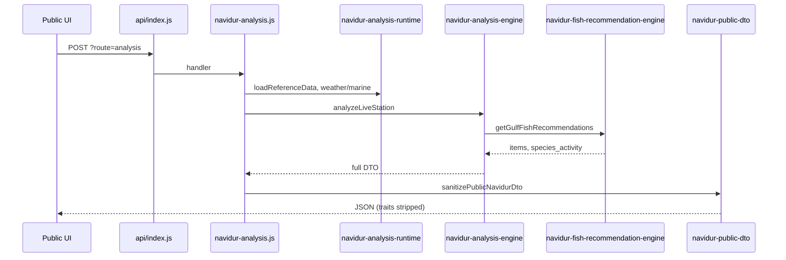

# NAVIDUR — Data Flow

> **Status:** Phase 1–2 documentation.  
> Describes known request paths only. See `testing-strategy.md` for verification approach.

---

## 1. Analysis Request Flow

---

## 2. Reference Data Inputs

Loaded via `readJsonFile` keys (see `serverless_api/_lib/data-store.js` `FILES` map), including:

| Key | Seed file |
|-----|-----------|
| `stations` | `data/stations.json` |
| `gulf_fish_database` | `data/gulf_fish_database.json` |
| `durur_master` | `data/durur_master.json` |
| `fish_species` | `data/fish_species.json` |
| `true_final_station_reference` | `data/true_final_station_reference.json` |

> **TODO:** Complete table for all `FILES` keys and consumers.

---

## 3. Live Environment

- Weather/marine resolution: `serverless_api/_lib/navidur-analysis-runtime.js` (`fetchWeatherAndMarineInputs`, etc.)
- Cached weather: `live_weather_cache` (KV or seed)

> **TODO:** Document Open-Meteo / Stormglass / CMEMS usage and fallback when marine data missing.

---

## 4. Station Resolution

- Request may pass `station_id` or coordinates.
- Stored station merged from KV/bundled `stations.json`.

> **TODO:** Document reference-station resolution for Dur lookup (high level only).

---

## 5. Output Shape (Public)

After sanitization, client receives (non-exhaustive):

- `station`, `environment`, `tide`, `dur`, `fishing`, `decision`, `public_navidur_summary`
- `fishing.fish_recommendations[]` with `score`, `confidence`, `reason_ar`, habitat fields

Internal trait arrays are stripped before public JSON.

> **TODO:** Link to OpenAPI or JSON schema if one is added later.

---

## 6. Phase A-Data Flow (Database Only)

Changes to `data/gulf_fish_database.json` affect recommendations **only after**:

1. Deployment bundles new JSON (`vercel.json` `includeFiles: data/*.json`), **and**
2. Production KV copy is updated (see `secrets-and-kv.md`).

Tag: `stable-phase-a-data`.

---

## 7. Open Questions / TODO

- [ ] Document snapshot cron (`/api/run-snapshots`) data writes.
- [ ] Document field session review pipeline and storage keys.
- [ ] Clarify whether `fish_species.json` still drives any live recommendation path post Phase A.
